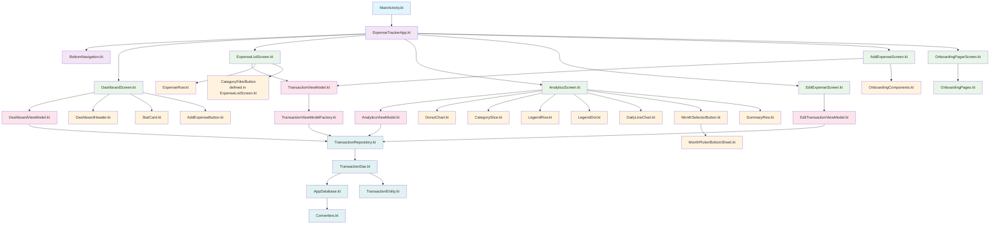

# ExpenseTracker 📱💰

A modern, feature-rich Android expense tracking application built with Jetpack Compose and Material3 design. Track your expenses, manage categories, and visualize spending patterns with beautiful charts and analytics.

## 🚀 Tech Stack

### **Core Technologies**
- **Language**: Kotlin
- **Framework**: Android Jetpack Compose
- **Architecture**: MVVM (Model-View-ViewModel)
- **Minimum SDK**: API 24 (Android 7.0)
- **Target SDK**: API 36 (Android 16)

### **Database & Persistence**
- **Local Database**: Room Database
- **Data Persistence**: DataStore Preferences
- **Type Converters**: Custom converters for complex data types

### **UI/UX**
- **Design System**: Material3 (Material Design 3)
- **Charts & Visualizations**: Custom Compose charts
- **Icons**: Material Icons Extended
- **Theming**: Dynamic theming support

### **Dependency Injection & Architecture**
- **ViewModels**: Android ViewModel
- **LiveData/Flow**: Kotlin Flow for reactive data streams
- **Repository Pattern**: Clean data access abstraction

### **Development Tools**
- **Build System**: Gradle with Kotlin DSL
- **Version Management**: Gradle Version Catalogs (`libs.versions.toml`)
- **Code Analysis**: KSP (Kotlin Symbol Processing)
- **Testing**: JUnit, Espresso

## ✨ Features

### **Core Functionality**
- ✅ **Add/Edit/Delete Expenses** - Complete CRUD operations for transactions
- ✅ **Dynamic Categories** - Add, edit, and remove custom categories
- ✅ **Category Protection** - Standard categories (Food, Transport, Shopping, Entertainment, Bills, Others) cannot be deleted
- ✅ **Date Picker** - Intuitive date selection for transactions
- ✅ **Amount Input** - Decimal input with proper formatting

### **Exchange Rate Tools** 🌍💱
- 💱 **Currency Converter** - Real-time currency conversion with dropdown selection
- 📊 **Latest Exchange Rates** - Current rates for all currencies (EUR base)
- 📈 **Historical Rates** - Exchange rates for specific dates with filtering
- 🏷️ **Currency Symbols** - Complete list of currency codes and names
- 📅 **Date Picker Integration** - Calendar-based date selection for historical data
- 🔄 **Real-time API** - Live data from ExchangeRate-API (free tier)

### **Analytics & Visualization**
- 📊 **Expense Analytics** - Comprehensive spending analysis
- 🥧 **Donut Charts** - Category-wise expense distribution
- 📈 **Line Charts** - Daily expense trends
- 📅 **Monthly Overview** - Month-by-month spending comparison
- 🎨 **Interactive Legends** - Detailed category breakdowns

### **User Experience**
- 🎯 **Onboarding Flow** - Guided setup for new users
- 📱 **Material3 Design** - Modern Android design language
- 🌙 **Responsive UI** - Optimized for various screen sizes
- ⚡ **Smooth Animations** - Fluid transitions and interactions
- 🔄 **Real-time Updates** - Live data synchronization

### **Data Management**
- 💾 **Persistent Storage** - Local Room database
- 🔄 **Data Synchronization** - Automatic state management
- 🏷️ **Category Filtering** - Filter expenses by categories
- 📊 **Sorting Options** - Sort by date, amount, or category

## 🏗️ Architecture

The app follows **MVVM (Model-View-ViewModel)** architecture with clean separation of concerns:

```
📁 app/src/main/java/com/example/expensetracker/
├── 📱 MainActivity.kt                 # App entry point
├── 🎯 ExpenseTrackerApp.kt            # Main composable & navigation
├── 🧭 BottomNavigation.kt             # Bottom navigation component
│
├── 📊 ui/
│   ├── 📱 screens/                    # UI Screens
│   │   ├── 🏠 DashboardScreen.kt      # Home dashboard
│   │   ├── 📋 ExpenseListScreen.kt    # Expense list with filtering
│   │   ├── 📈 AnalyticsScreen.kt      # Charts & analytics
│   │   ├── 💱 ExchangeRateScreen.kt   # Exchange rate tools
│   │   ├── ✏️ EditExpenseScreen.kt     # Edit transactions
│   │   ├── ➕ AddExpenseScreen.kt      # Add new expenses
│   │   └── 🎓 onboarding/             # Onboarding flow
│   │
│   ├── 🧩 components/                 # Reusable UI components
│   │   ├── 📊 Charts & Analytics      # DonutChart, DailyLineChart, etc.
│   │   ├── 🎨 UI Components           # Buttons, Cards, etc.
│   │   └── 📅 Date/Time Pickers       # MonthPicker, etc.
│   │
│   ├── 🏗️ transaction/                # Transaction management
│   │   ├── TransactionViewModel.kt    # Transaction operations
│   │   └── TransactionViewModelFactory.kt
│   │
│   └── 🧠 viewmodel/                  # Specialized ViewModels
│       ├── DashboardViewModel.kt      # Dashboard logic
│       ├── AnalyticsViewModel.kt      # Analytics calculations
│       ├── EditTransactionViewModel.kt # Edit operations
│       └── 💱 ExchangeRateViewModel.kt # Exchange rate operations
│
├── 🌐 data/
│   ├── 💾 local/                      # Local data layer
│   │   ├── 🗄️ database/               # Room database setup
│   │   ├── 📋 dao/                    # Data Access Objects
│   │   └── 📚 repository/             # Repository pattern
│   │
│   └── 🌍 remote/                     # Remote data layer
│       ├── 🔗 api/                    # API interfaces
│       │   └── 💱 ExchangeRateApi.kt  # ExchangeRate-API client
│       ├── 📦 model/                  # API data models
│       │   ├── ExchangeRateResponse.kt
│       │   └── SymbolsResponse.kt
│       └── 📚 repository/             # Remote repository
│           └── ExchangeRateRepository.kt
│
└── ⚙️ res/xml/                        # Resources
    └── 🔒 network_security_config.xml # Network security configuration
```

### **Architecture Diagram**



### 🔗 API Integration

**ExchangeRate-API (Free Tier)**
- **Base URL**: `http://api.exchangeratesapi.io/v1/`
- **Features**: Latest rates, currency symbols, conversion, historical rates
- **Limitations**: EUR base only, HTTP protocol, no paid features
- **Network Config**: Cleartext traffic enabled for HTTP API calls

## � Key Decisions

Throughout the development of ExpenseTracker, several key decisions were made to ensure modern, maintainable, and scalable code:

### **UI Framework Choice**
- **Decision**: Adopted Jetpack Compose over traditional XML layouts
- **Rationale**: Modern declarative UI framework provides better performance, easier testing, and more maintainable code
- **Impact**: Enabled rapid UI development with reusable composables and smooth animations

### **Architecture Pattern**
- **Decision**: Implemented MVVM (Model-View-ViewModel) architecture
- **Rationale**: Clean separation of concerns, improved testability, and better data flow management
- **Impact**: Easier maintenance and scalability as the app grows

### **Database Solution**
- **Decision**: Used Room database with DAO pattern
- **Rationale**: Type-safe database operations, compile-time SQL verification, and seamless integration with LiveData/Flow
- **Impact**: Robust data persistence with minimal boilerplate code

### **Category Management**
- **Decision**: Implemented dynamic categories using DataStore for persistence
- **Rationale**: Allows users to customize categories while protecting standard ones
- **Impact**: Enhanced user experience with flexible categorization

### **Compose Compatibility Fixes**
- **Decision**: Updated clickable modifier usage to match Compose 1.5+ APIs
- **Rationale**: Resolved crashes caused by deprecated APIs in newer Compose versions
- **Impact**: Ensured app stability and compatibility with latest Android updates

### **Documentation Strategy**
- **Decision**: Created comprehensive README with interactive Mermaid architecture diagram
- **Rationale**: Improves developer onboarding and project maintainability
- **Impact**: Professional presentation for GitHub repository and future contributions

### **Version Management**
- **Decision**: Used Gradle Version Catalogs for dependency management
- **Rationale**: Centralized version control and easier dependency updates
- **Impact**: Reduced build configuration complexity and improved maintainability

## �🛠️ Installation & Setup

### **Prerequisites**
- **Android Studio**: Arctic Fox or later
- **JDK**: 17 or later
- **Android SDK**: API 24+ (Android 7.0+)
- **Device/Emulator**: Android device or emulator for testing

### **Clone the Repository**
```bash
git clone https://github.com/sulthann-nd/expense-tracker.git
cd expense-tracker
```

### **Open in Android Studio**
1. Launch Android Studio
2. Select **"Open an existing Android Studio project"**
3. Navigate to the cloned directory and select it
4. Wait for Gradle sync to complete

### **Build & Run**
1. **Connect Device/Start Emulator**
2. **Run Configuration**: Select `app` configuration
3. **Click Run** ▶️ or press `Shift + F10`

### **First Launch**
- The app will show an onboarding flow for new users
- Grant necessary permissions if prompted
- Start adding your expenses!

## 📱 Usage Guide

### **Getting Started**
1. **Complete Onboarding** - Follow the welcome screens
2. **Add Your First Expense** - Tap the floating action button
3. **Choose Category** - Select from existing or add new categories
4. **Set Amount & Date** - Input expense details
5. **Save** - Your expense is now tracked!

### **Managing Categories**
- **Add Categories**: In expense form, select "Add New Category"
- **Delete Categories**: Long-press category filters in expense list
- **Protected Categories**: Standard categories cannot be removed

### **Viewing Analytics**
- **Navigate to Analytics** tab
- **View Charts**: Donut chart for category breakdown
- **Line Chart**: Daily spending trends
- **Monthly Selector**: Switch between different months

### **Exchange Rate Tools** 🌍💱

#### **Currency Converter**
- **Navigate to Exchange Rate** tab
- **Select currencies**: Choose "From" and "To" currencies from dropdown menus
- **Enter amount**: Input the amount to convert
- **Convert**: Get real-time conversion rates

#### **Latest Exchange Rates**
- **View current rates**: All currencies relative to EUR base
- **Filter currencies**: Use dropdown to search specific currencies
- **Real-time data**: Fetched from ExchangeRate-API

#### **Historical Rates**
- **Select date**: Use calendar picker to choose historical date
- **Filter currencies**: Choose specific currency from dropdown
- **View past rates**: Exchange rates for the selected date

#### **Currency Symbols**
- **Browse all currencies**: Complete list of currency codes and names
- **Search functionality**: Filter currencies by code or name
- **Reference guide**: Useful for currency selection

### **Editing Expenses**
- **Tap any expense** in the list to edit
- **Modify details** and save changes
- **Delete expenses** using the delete option

## 🔧 Configuration

### **Gradle Configuration**
The project uses Gradle with version catalogs for dependency management:

```kotlin
// libs.versions.toml - Version management
[versions]
agp = "8.9.3"
kotlin = "2.0.21"
composeBom = "2024.05.00"

// build.gradle.kts - Module configuration
dependencies {
    implementation(libs.androidx.room.runtime)
    implementation(libs.androidx.datastore.preferences)
    // ... other dependencies
}
```

### **Key Dependencies**
```kotlin
// Core Android
androidx-core-ktx = "1.17.0"
androidx-lifecycle-runtime-ktx = "2.10.0"
androidx-activity-compose = "1.12.2"

// Compose BOM
androidx-compose-bom = "2024.05.00"
androidx-material3 = "1.3.0"

// Database
androidx-room-runtime = "2.8.4"
androidx-datastore-preferences = "1.1.1"

// Navigation
androidx-navigation-compose = "2.8.0"

// Networking (Exchange Rate API)
retrofit = "2.9.0"
converter-gson = "2.9.0"
okhttp3-logging = "4.12.0"
gson = "2.10.1"
```

## 🧪 Testing

### **Unit Tests**
```bash
./gradlew testDebugUnitTest
```

### **Instrumented Tests**
```bash
./gradlew connectedDebugAndroidTest
```

### **Test Coverage**
- **ViewModels**: Business logic testing
- **Repository**: Data access testing
- **UI Components**: Compose component testing

## 🤝 Contributing

We welcome contributions! Please follow these steps:

### **Development Setup**
1. **Fork** the repository
2. **Create** a feature branch: `git checkout -b feature/your-feature`
3. **Make changes** and test thoroughly
4. **Commit** with clear messages: `git commit -m "Add: feature description"`
5. **Push** to your fork: `git push origin feature/your-feature`
6. **Create** a Pull Request

### **Code Style**
- Follow **Kotlin coding conventions**
- Use **meaningful variable names**
- Add **documentation** for complex functions
- Ensure **Compose previews** for UI components

### **Commit Guidelines**
```
feat: add new expense categories
fix: resolve clickable modifier crash
docs: update README with installation guide
style: format code according to Kotlin standards
```

## 📄 License

This project is licensed under the **MIT License** - see the [LICENSE](LICENSE) file for details.

## 🙏 Acknowledgments

- **Material3 Design** for modern Android design system
- **Jetpack Compose** for declarative UI framework
- **Room Database** for robust local data persistence
- **Kotlin** for excellent Android development experience

## 📞 Support

If you encounter any issues or have questions:

1. **Check existing issues** on GitHub
2. **Create a new issue** with detailed description
3. **Include logs** and reproduction steps
4. **Label appropriately** (bug, enhancement, question)

---

**Happy expense tracking!** 🎉📊

*Built with ❤️ using modern Android development practices*